# Hi 👋 I'm Hiro

### Full-Stack Engineer Intern | SaaS Startup in Japan

## Tech Stack

- **Languages:**  
  
  
  
  
  

- **Frontend:**  
  
  
  

- **Backend:**  
  

- **Database:**  
  

- **DevOps:**  
  
  
  

## Language Usage

  

