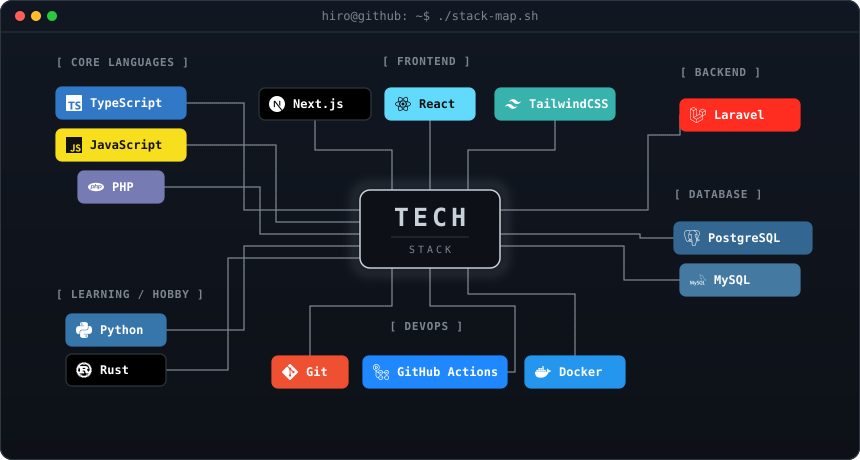

<h3><code>hiro@github ~ $ whoami</code></h3>

<code>Full-Stack Engineer Intern | SaaS Startup in Japan</code>

<table>
<tr>
<td valign="top"></td>
<td valign="top"></td>
</tr>
</table>

 
 

<h3><code>hiro@github ~ $ ./contributions.sh</code></h3>

 
 

<h3><code>hiro@github ~ $ ./stack-map.sh</code></h3>

 
 

<!-- Legacy Tech Stack design. Kept for possible restoration.

## Tech Stack

- **Core Stack:**
  - **Languages:** 
    
    
    
  - **Frontend:** 
    
    
    
  - **Backend:** 
    
  - **Database:** 
    
    
  - **DevOps:** 
    
    
    

- **Learning / Hobby:** 
  
  

-->
